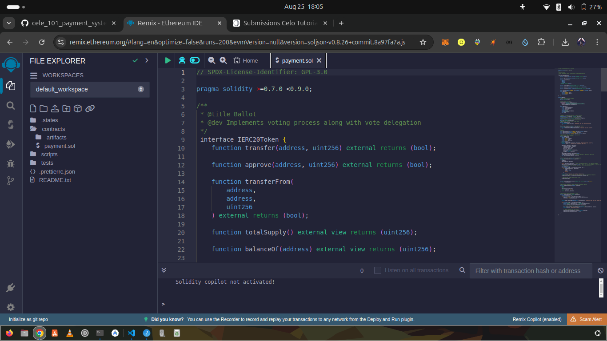
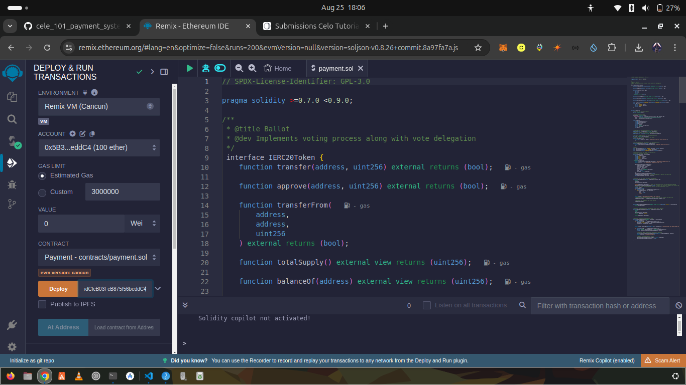
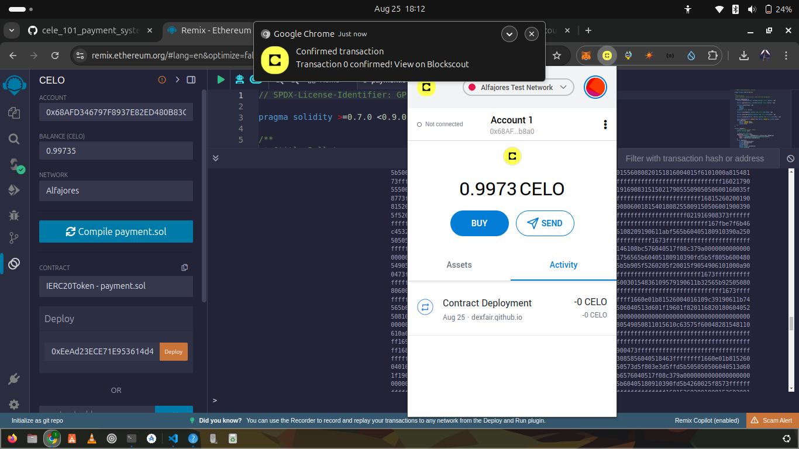
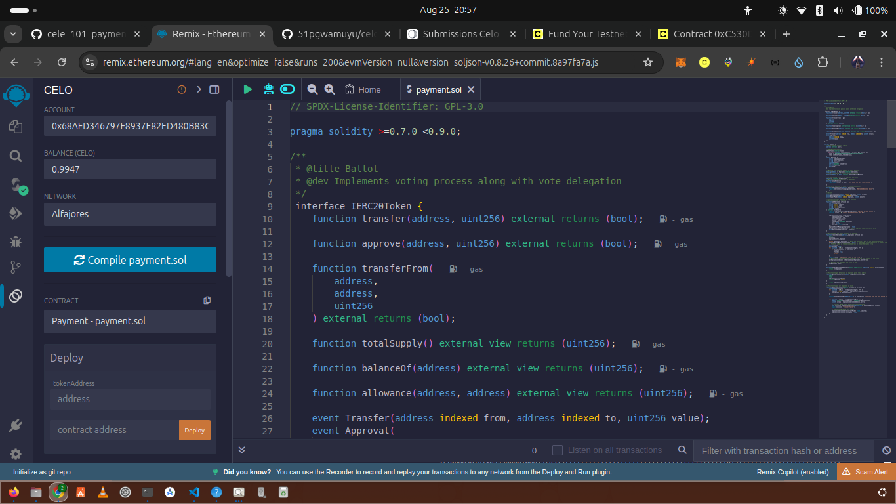
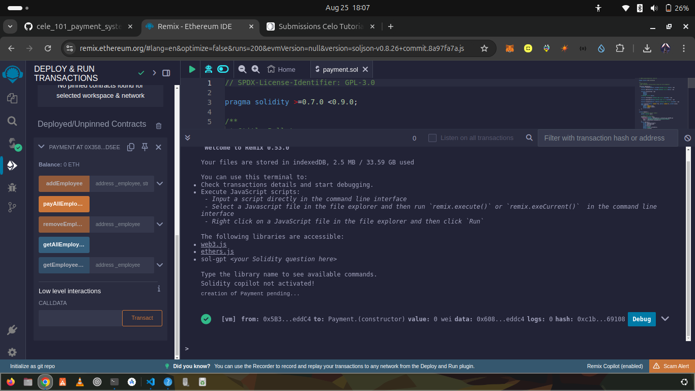

# PAYMENT SMART CONTRACT

## Table of Contents
- [Introduction](#introduction)
- [What is Celo](#what-is-celo)
- [Prerequisites](#prerequisites)
- [Requirements](#requirements)
- [Developing our Smart Contract](#developing-our-smart-contract)
- [Testing And Deploying the Smart Contract](#testing-and-deploying-the-smart-contract)
- [Conclusion](#conclusion)

---
## Introduction
Welcome to this comprehensive tutorial on writing a smart contract in Solidity for the Celo Blockchain. In this tutorial, we will guide you through the steps and requirements necessary for creating a smart contract on Celo by developing a simple payment system. This tutorial assumes you have a basic understanding of Ethereum and Solidity, as Celo is built on similar principles but tailored for mobile users and optimized for stability and scalability.

## What is Celo
Celo is a platform acting as a global payment infrastructure for cryptocurrencies that aims to target mobile users. 

To this end, Celo’s goal is for financial activity to be accessible to anyone globally thanks to its ability for payments to be sent to and from any phone number in the world.

In addition to basic payments, Celo can support the development of decentralized applications on its blockchain. Thus far, these dapps include one allowing anyone to contribute to a community’s universal basic income scheme, as well as a crowdfunding platform for social causes.for mor info visit [celo](celo.org)

## Prerequisites
 - Basic understanding of blockchain concepts.
 - Basic understanding of what a smart contract is.
 - Basic knowledge on Solidity and its concepts. you can click here to learn
   

## Requirements

 - Good internet connection since we will be coding online
 - Celo Extension Wallet.
 - Familiarity with [remix ide](https://remix.ethereum.org/)

## Developing our Smart Contract

We will go through an example of a celo smart contract I have  written in solidity for art marketplace
Navigate to **Remix IDE**.

Create a new file and call it a artmarketplace.sol and paste the following code below
```
    // SPDX-License-Identifier: GPL-3.0

     pragma solidity ^0.8.0;
```
SPDX-License-Identifier: This is a standard way to identify the license of a software project, It helps in automatically identifying the license of a piece of software, which is crucial for compliance and legal reasons.

#### pragma solidity ^0.8.0 ;

##### pragma: 
This keyword is used to specify certain compiler directives or instructions. In this context, it tells the Solidity compiler how to handle the versioning of the code.

##### solidity: 
Indicates that the directive is related to the Solidity compiler.

##### >=0.7.0:
Specifies the minimum compiler version required. Any compiler version greater than or equal to 0.7.0 can compile this contract. This ensures that features introduced in versions prior to 0.7.0 are available.

##### <0.9.0: 
Specifies the maximum compiler version allowed. Any compiler version less than 0.9.0 can compile this contract. This is typically done to avoid potential breaking changes introduced in newer versions.


```
interface IERC20Token {
function transfer(address, uint256) external returns (bool);

    function approve(address, uint256) external returns (bool);

    function transferFrom(
        address,
        address,
        uint256
    ) external returns (bool);

    function totalSupply() external view returns (uint256);

    function balanceOf(address) external view returns (uint256);

    function allowance(address, address) external view returns (uint256);

    event Transfer(address indexed from, address indexed to, uint256 value);
    event Approval(
        address indexed owner,
        address indexed spender,
        uint256 value
    );

}
```
The IERC20Token interface outlines the standard functions and events defined by the ERC-20 token standard.To understand this we will go through each function defined above.

##### IERC20
This a standard interface for tokens on the Ethereum blockchain, ensuring that all tokens implementing this standard behave in a predictable way. This standardization facilitates interoperability between different tokens and wallets/exchanges. Let's break down the components of this interface:

##### interface IERC20Token {}
Interfaces in Solidity define a set of functions that a contract must implement if it wants to conform to this interface.

## Functions

### function transfer(address to, uint256 value):

This function allows the caller (the sender) to transfer a specified amount of tokens to another address. It's a fundamental operation that enables any holder of tokens to send them to another account. The function returns a boolean indicating success (true) or failure (false).

### function approve(address spender, uint256 value):

Before a token holder can spend tokens owned by someone else (for example, to pay a fee or make a payment on behalf of the original owner), they must obtain approval from the token owner. This function sets an allowance, specifying how many tokens the spender is allowed to move on behalf of the owner. It also returns a boolean indicating success or failure.

### function transferFrom(address from, address to, uint256 value): 

This function transfers a specified amount of tokens from one address to another. Unlike transfer, which moves tokens from the caller's address, transferFrom allows anyone who has been approved by the token owner to move tokens on their behalf. This is particularly useful for decentralized exchanges and other DeFi applications that need to move tokens between accounts without holding any tokens themselves.

### function totalSupply():

This function returns the total supply of tokens in existence. This is a constant value that represents the maximum number of tokens that will ever exist

### function balanceOf(address account)

This function queries and returns the current balance of tokens held by the specified address. This function is essential for checking the available funds before initiating transactions.

### function allowance(address owner, address spender)

This function returns the remaining number of tokens that the spender is still allowed to draw from the owner's account. This is part of the approval mechanism, allowing holders to see how much of their tokens have been approved for spending by others.

## Events

### Transfer(address indexed from, address indexed to, uint256 value):

This event is emitted whenever tokens are transferred from one address to another. The from and to addresses are indexed, meaning they can be queried easily, and the value indicates the amount of tokens transferred. This event is crucial for tracking token movements and auditing transactions.

### Approval(address indexed owner, address indexed spender, uint256 value):

This Event is emitted when the approve function is called, signaling that the spender is now allowed to withdraw up to a certain amount of tokens from the owner's account. Like the Transfer event, the owner and spender addresses are indexed, facilitating easy queries.


```
contract Payment {
    // Owner of the contract (admin)
    address internal owner;

    //ERC20 token interface
    IERC20Token internal token;
    constructor(address _tokenAddress) {
        owner =  0x874069Fa1Eb16D44d622F2e0Ca25eeA172369bC1;
        token = IERC20Token(_tokenAddress);
    }

}
```
#### contarct Payment{...}:

  To define a contract in solidity we use name **contract** followed by name of your contract like oures is Payment.

### address internal owner 

**address** is used to represent account on the blockchain.To get ccUsdTokenAddres you need Celo Wallet,You can Install a Celo wallet extension from you browser extension store like chromestore.Finish the neccessary steps for registration.<>Choose you test network for our case we will go with **Alfajores Test Network**.This is an EVM-compatible blockchain developed by Celo. It serves as a testnet for Celo, allowing developers to experiment and deploy their smart contracts in a controlled environment before deploying to the main Celo network. Alfajores offers a low-cost and developer-friendly platform for testing and showcasing applications built on Celo.Copy the address and head to [faucet](https://celo.org/developers/faucet) to claim free tokens for deploying your smart contract.

**constructor** is executed automatically once when the contract is deployed to the blockchain.
The primary goal of the constructor in this context is to set the address of the Celo USD (cUSD) token, which is represented by the cUsdTokenAddress state variable.By setting this address during deployment, the contract can later reference it for operations involving the cUSD token, such as transferring funds or checking balances.
Set the address of owner to that you have obtain from your wallet inside constructor.This sets the owner variable to a fixed address.

##### token = IERC20Token(_tokenAddress);
This initializes the token variable with the provided **_tokenAddress**
It creates an instance of the IERC20Token interface, binding it to the address passed to the constructor.
This assumes that the _tokenAddress passed to the constructor is a valid ERC20 token address.

```
 struct Employee {
        string companyworkingfor; 
        string nameofemployee;
        string position;
        uint256 salary;
        address payable useraddress;
        uint256 lastPaid;
        bool paid;
    }


```
### struct 

This is a custom data type that allows you to group together variables of diffrent data types. Structs are particularly useful for organizing related pieces of data.

### Employee
This is the name of user defined data type
### string
This field  allow  text-based input.

### address payable useraddress;

The type of address payable owner  stores the address of the employee. The payable keyword allows this address to receive tokens. 

### uint256:
This a data type that stands for unsigned integer .
### bool
It stands for true or false

```
   // Mapping from employee address to their details
    mapping(address => Employee) internal employees;
    // Separate mapping to track if an employee exists
    mapping(address => bool) internal employeeExistsMapping;

```
### _mappings_

This is a powerful data structures for associating unique keys with values. Mappings are essentially hash tables, offering constant-time complexity for reading and writing operations. Each mapping is declared with a specific key type and a value type, and they are all marked as internal, meaning they can only be accessed within the contract or contracts deriving from it.Like in the example above key type is address associated with Employee struct as its value which contain details about employee.
The keys are used to get details of an employee.

```
    //Array to keep track of all employee addresses
    address[] internal allEmployees;
```
This array is used to keep addreses of all employee once their have been added to payslip

```
    // Modifier to restrict access to the owner
    modifier onlyOwner() {
        require(msg.sender == owner, "Only owner can call this function");
        _;
    }
    // Corrected modifier to check if the employee exists
    modifier employeeExists(address _employee) {
        require(employeeExistsMapping[_employee], "Employee does not exist");
        _;
    }
```
#### Modifiers 
Modifiers in Solidity are special functions that can be applied to other functions to add additional functionality or restrictions. They are denoted by the **modifier** keyword and are typically placed above the function they modify.
In the exmple above **onlyOwner** modifier checks if the sender is the contract's owner.It throws an error if the condition isn't met, indicating that only the owner can call the function.The underscore (_) is used to indicate where the original function body should be placed.

```
 // Events
    event EmployeeAdded(address indexed employee, uint256 salary);
    event EmployeeRemoved(address indexed employee);
    event SalaryPaid(address indexed employee, uint256 amount);


```
The events outlined above are a core aspect of the payment smart contract, serving as notifications that occur when specific actions take place within the contract.

### event EmployeeAdded
#### Parameters:
**employee**: An address representing the employee being added
**salary**: A uint256 representing the employee's annual salary

#### Key Points:

- The indexed keyword makes the employee field searchable on the blockchain.
- This event is emitted when a new employee is added to the system.
- It provides information about both the employee and their initial salary.

## Function where the owner add employee to paylist

```
 function addEmployee(address _employee,string memory _company,string memory _name,string memory _position,uint256 _salary) external onlyOwner {
        require(!employeeExistsMapping[_employee], "Employee already exists");
        require(_salary > 0, "Salary must be greater than 0");

        employees[_employee] = Employee({
            companyworkingfor: _company,
            nameofemployee: _name,
            position: _position,
            salary: _salary,
            useraddress: payable(_employee),
            paid: false,
            lastPaid: block.timestamp
        });
        employeeExistsMapping[_employee] = true;
        allEmployees.push(_employee); // Add the employee's address to the array
        emit EmployeeAdded(_employee, _salary);
    }

```
### Function addEmployee

 It takes five parameters: the employee's address, company name, employee name, position, and salary. The function is restricted to the contract owner and performs several checks before adding the employee to the system.
##### external onlyOwner 
The function is marked as external, meaning it can only be called from outside the contract.It uses the onlyOwner modifier, restricting access to the contract owner.

##### require(!employeeExistsMapping[_employee], "Employee already exists"); and require(_salary > 0, "Salary must be greater than 0");
Checks if the employee doesn't already exist in the system.Ensures the salary is positive.

```
  employees[_employee] = Employee({
    companyworkingfor: _company,
    nameofemployee: _name,
    position: _position,
    salary: _salary,
    useraddress: payable(_employee),
    paid: false,
    lastPaid: block.timestamp
});

```
Creates a new Employee struct for the given address.Sets all properties based on the input parameters.
##### employeeExistsMapping[_employee] = true;
Marks the employee as existing in the system.
##### allEmployees.push(_employee);
Adds the employee's address to an array of all employees.
##### emit EmployeeAdded(_employee, _salary);
Emits an event signaling that a new employee has been added.

### The below function is used to remove employee from payslip by owner.
```

   // Function for the owner to remove an employee
    function removeEmployee(address _employee)
        public
        onlyOwner
        employeeExists(_employee)
    {
        delete employees[_employee];
        employeeExistsMapping[_employee] = false; 
        // Find the index of the employee address in the allEmployees array
        uint256 index;
        bool found = false;
        for (uint256 i = 0; i < allEmployees.length; i++) {
            if (allEmployees[i] == _employee) {
                index = i;
                found = true;
                break;
            }
        }
        require(found, "Employee not found in the array");
        // Replace the removed employee's address with the last element in the array
        allEmployees[index] = allEmployees[allEmployees.length - 1];

        // Decrease the length of the array by one
        allEmployees.pop();
    }
    
```

### The below function is used to get all  employess in payslip of a company 
```
    
     function getAllEmployeeAddresses() public view returns (address[] memory) {
        return allEmployees;
    }
    
   ```
### Function to get details of an employee given their address

```
    function getEmployeeDetails(address _employee)
        public
        view
        employeeExists(_employee)
        returns (Employee memory)
    {
        return employees[_employee];
    }
```
### The below function is used to pay all salary to employees from owner account.
#### This function below does the following:

- Calculates the total salary of all employees.
- Checks if the contract has sufficient funds to pay everyone.
- Transfers the calculated total salary to all employees.
- Updates the lastPaid and paid status for each employee.


```
 // Function to pay all employees at once
    function payAllEmployees() public onlyOwner {
        uint256 totalSalary = 0;
        for (uint256 i = 0; i < allEmployees.length; i++) {
            Employee storage employee = employees[allEmployees[i]];
            totalSalary += employee.salary;
        }

        require(token.balanceOf(address(this)) >= totalSalary, "Contract does not have enough tokens");

        for (uint256 i = 0; i < allEmployees.length; i++) {
            address payable employeeAddress = payable(allEmployees[i]);
            uint256 salary = employees[employeeAddress].salary;

            // Transfer ERC20 tokens from contract to employee
            bool success = token.transferFrom(address(this), employeeAddress, salary);
            require(success, "Transfer failed");

            // Update lastPaid and paid status
            employees[employeeAddress].lastPaid = block.timestamp;
            employees[employeeAddress].paid = true;
        }
    }

```

## This is the full code 

```

// SPDX-License-Identifier: GPL-3.0

pragma solidity >=0.7.0 <0.9.0;

/**
 * @title Ballot
 * @dev Implements voting process along with vote delegation
 */
 interface IERC20Token {
    function transfer(address, uint256) external returns (bool);

    function approve(address, uint256) external returns (bool);

    function transferFrom(
        address,
        address,
        uint256
    ) external returns (bool);

    function totalSupply() external view returns (uint256);

    function balanceOf(address) external view returns (uint256);

    function allowance(address, address) external view returns (uint256);

    event Transfer(address indexed from, address indexed to, uint256 value);
    event Approval(
        address indexed owner,
        address indexed spender,
        uint256 value
    );
}

contract Payment {
    // Owner of the contract (admin)
    address internal owner;

    // ERC20 token interface
    IERC20Token internal token;
      constructor(address _tokenAddress) {
        owner =  0x874069Fa1Eb16D44d622F2e0Ca25eeA172369bC1;
        token = IERC20Token(_tokenAddress);
    }
    struct Employee {
        string companyworkingfor;
        string nameofemployee;
        string position;
        uint256 salary;
        address payable useraddress;
        uint256 lastPaid;
        bool paid;
    }

    // Mapping from employee address to their details
    mapping(address => Employee) internal employees;
    // Separate mapping to track if an employee exists
    mapping(address => bool) internal employeeExistsMapping;

    // Array to keep track of all employee addresses
    address[] internal allEmployees;
    // Modifier to restrict access to the owner
    modifier onlyOwner() {
        require(msg.sender == owner, "Only owner can call this function");
        _;
    }
    // Corrected modifier to check if the employee exists
    modifier employeeExists(address _employee) {
        require(employeeExistsMapping[_employee], "Employee does not exist");
        _;
    }
    // Events
    event EmployeeAdded(address indexed employee, uint256 salary);
    event EmployeeRemoved(address indexed employee);
    event SalaryPaid(address indexed employee, uint256 amount);

    // Constructor sets the owner of the contract
    // Function to add an employee
    function addEmployee(
        address _employee,
        string memory _company,
        string memory _name,
        string memory _position,
        uint256 _salary
    ) external onlyOwner {
        require(!employeeExistsMapping[_employee], "Employee already exists");
        require(_salary > 0, "Salary must be greater than 0");

        employees[_employee] = Employee({
            companyworkingfor: _company,
            nameofemployee: _name,
            position: _position,
            salary: _salary,
            useraddress: payable(_employee),
            paid: false,
            lastPaid: block.timestamp
        });
        employeeExistsMapping[_employee] = true;
        allEmployees.push(_employee); // Add the employee's address to the array
        emit EmployeeAdded(_employee, _salary);
    }

    // Function for the owner to remove an employee
    function removeEmployee(address _employee)
        public
        onlyOwner
        employeeExists(_employee)
    {
        delete employees[_employee]; // Reset the employee's data in the employees mapping
        employeeExistsMapping[_employee] = false; // Update the existence mapping to reflect removal
        // Find the index of the employee address in the allEmployees array
        uint256 index;
        bool found = false;
        for (uint256 i = 0; i < allEmployees.length; i++) {
            if (allEmployees[i] == _employee) {
                index = i;
                found = true;
                break;
            }
        }
        require(found, "Employee not found in the array");
        // Replace the removed employee's address with the last element in the array
        allEmployees[index] = allEmployees[allEmployees.length - 1];

        // Decrease the length of the array by one
        allEmployees.pop();
    }

    function getAllEmployeeAddresses() public view returns (address[] memory) {
        return allEmployees;
    }

    // Function to get details of an employee given their address
    function getEmployeeDetails(address _employee)
        public
        view
        employeeExists(_employee)
        returns (Employee memory)
    {
        return employees[_employee];
    }

    // Function to pay all employees at once
    function payAllEmployees() public onlyOwner {
        uint256 totalSalary = 0;
        for (uint256 i = 0; i < allEmployees.length; i++) {
            Employee storage employee = employees[allEmployees[i]];
            totalSalary += employee.salary;
        }

        require(token.balanceOf(address(this)) >= totalSalary, "Contract does not have enough tokens");

        for (uint256 i = 0; i < allEmployees.length; i++) {
            address payable employeeAddress = payable(allEmployees[i]);
            uint256 salary = employees[employeeAddress].salary;

            // Transfer ERC20 tokens from contract to employee
            bool success = token.transferFrom(address(this), employeeAddress, salary);
            require(success, "Transfer failed");

            // Update lastPaid and paid status
            employees[employeeAddress].lastPaid = block.timestamp;
            employees[employeeAddress].paid = true;
        }
    }

}

```


## Testing And Deploying the Smart Contract

To test the smart contract vist [remix](https://docs.celo.org/developer/deploy/remix). Install celo extension wallet from chromestore for chrome users.
To create a contract go to remix ide and  create a new file for your Solidity smart contract in Remix like ours we will name it as 
*payment.sol* and paste the code above.



### To Compile Contract:

Click on the "Solidity Compiler" tab in the sidebar and select the appropriate compiler version for your contract. Click "Compile" to compile your contract code.


Go to your celo wallet that is Alfajores Test Network and copy the address

After copying celo wallet address paste it to the space next to deploy button

if your smart have deployed successfully you will see this



## Conclusion
In this tutorial, we've explored the process of building a payment system on the Celo blockchain using Solidity. 
We’ve learned about various components of the contract, including structs for representing various data types for our contract, mappings for storing these objects, events for logging significant occurrences, and various functions 